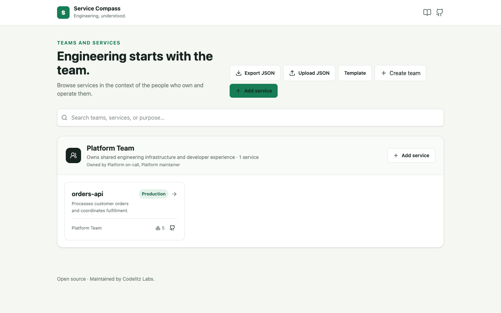
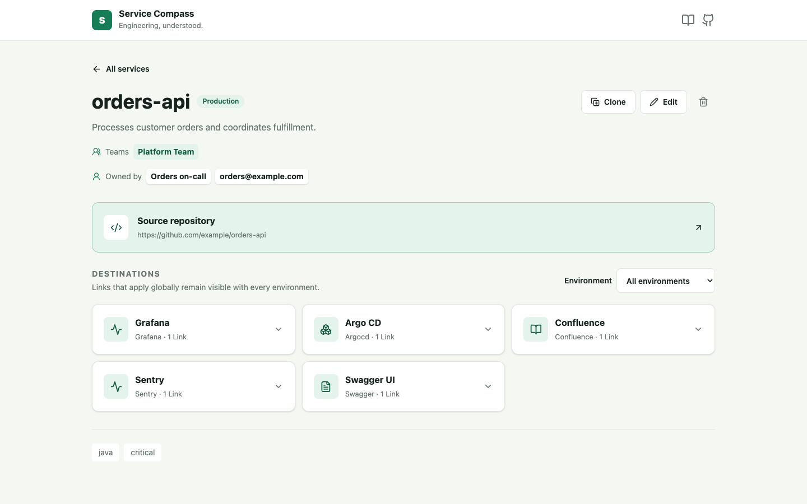
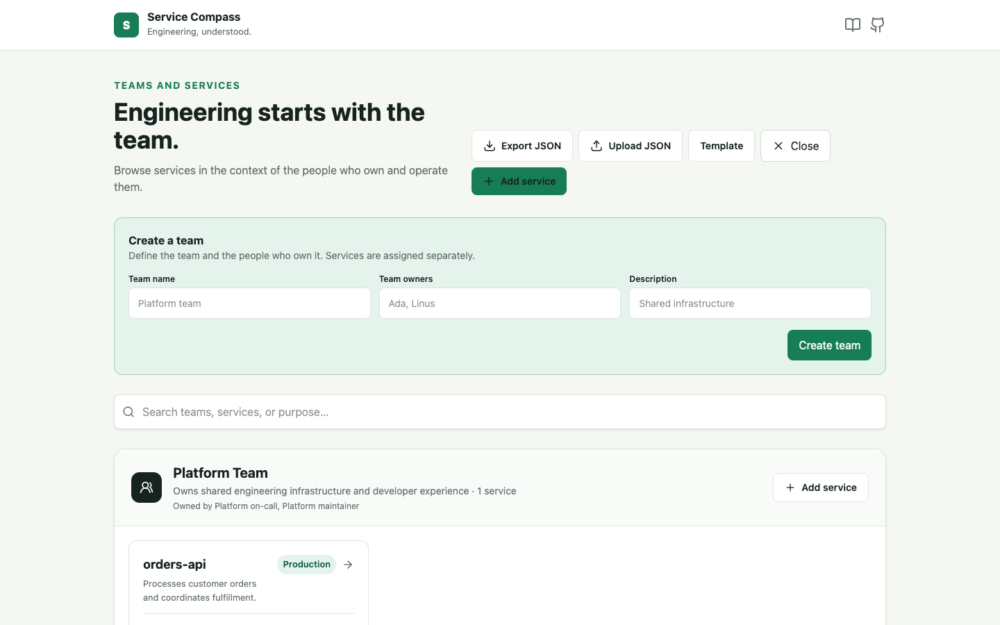

# Service Compass

Everything an engineer needs about a service in one place.

Service Compass is a lightweight, focused, and opinionated engineering context platform maintained by Codelitz Labs. It is not intended to clone Spotify Backstage or become a general developer-portal framework. It keeps service ownership, repositories, environments, documentation, observability, deployment, and other useful links easy to find.



> **Project status:** Service Compass is in an early open-source stage. The APIs and data model may evolve before a stable release. It has not yet been declared production-ready.

## Problem

Understanding one service often means moving between GitHub, Swagger, Grafana, Kubernetes, deployment tools, documentation, and team directories. Service Compass centralizes references to those systems without trying to replace them.

## Current features

- Service catalog with search, lifecycle, tags, descriptions, and owners
- Team management and service-to-team ownership
- Repository links
- Environment-specific destinations
- Documentation, Swagger, logs, metrics, dashboards, deployment, and arbitrary useful links
- Reusable catalog JSON import, export, and template
- Optional GitHub OAuth login
- Responsive interface
- Local fictional starter data

Service Compass stores links to external tools; it does not currently integrate with their APIs or import GitHub repositories.

## Screenshots

### Service catalog

Browse services, search the catalog, and quickly identify ownership, lifecycle, and technical context.


### Service details

View repositories, environments, documentation, observability, deployment, and other useful service links in one place.



### Team management

Manage teams and maintain clear service ownership information.



## Architecture

The React single-page application calls a Spring Boot JSON API. Controllers handle HTTP input, services contain use-case and transactional logic, Spring Data repositories persist the JPA model, and Flyway manages PostgreSQL schema changes. GitHub is currently used only as an OAuth identity provider; there is no repository API adapter.

The code has clear application layers, but it is organized as a pragmatic feature package rather than a strict ports-and-adapters implementation. See [Architecture](docs/architecture.md).

## Technology stack

| Area | Technologies |
| --- | --- |
| Frontend | React 19, TypeScript 5.8, Vite 7, React Router 7, TanStack Query 5, Tailwind CSS 4, Zustand 5, Vitest 3 |
| Backend | Java 25, Spring Boot 4.1, Spring Security, Spring Data JPA, Bean Validation, Flyway, springdoc OpenAPI, MapStruct |
| Data | PostgreSQL 17; H2 for local-profile tests |
| Infrastructure | Docker, Docker Compose, Nginx, GitHub Actions |

Exact dependency versions are recorded in [`frontend/package.json`](frontend/package.json), [`frontend/package-lock.json`](frontend/package-lock.json), and [`backend/pom.xml`](backend/pom.xml).

## Getting started

### Prerequisites

- Docker with Docker Compose
- For manual development: Java 25 and Maven 3.9+
- For manual frontend development: Node.js 22 and npm

### Docker Compose

Create the local configuration and start the complete stack:

```bash
cp .env.example .env
docker compose up --build
```

Open:

- application: <http://localhost:5173>
- backend API: <http://localhost:8080/api>
- Swagger UI: <http://localhost:8080/api/docs>
- OpenAPI document: <http://localhost:8080/api/openapi>

Stop the stack with `docker compose down`. Add `--volumes` only when you intentionally want to delete the local PostgreSQL data.

### Manual development

Start PostgreSQL:

```bash
docker compose up -d postgres
```

Run the backend from another terminal:

```bash
cd backend
mvn spring-boot:run
```

Run the frontend from another terminal:

```bash
cd frontend
npm ci
npm run dev
```

Vite serves the frontend at <http://localhost:5173> and proxies `/api` to the backend.

For an in-memory database instead of PostgreSQL:

```bash
cd backend
mvn spring-boot:run -Dspring-boot.run.profiles=local
```

### GitHub OAuth

OAuth is optional and disabled by default. Create a GitHub OAuth app with callback URL:

```text
http://localhost:8080/login/oauth2/code/github
```

Set `GITHUB_CLIENT_ID` and `GITHUB_CLIENT_SECRET` in your shell, then run:

```bash
cd backend
mvn spring-boot:run -Dspring-boot.run.profiles=oauth
```

The current Compose service does not enable or pass OAuth configuration.

## Configuration

Copy [`.env.example`](.env.example) to `.env` for Compose. The checked-in values are development-only examples.

| Variable | Purpose | Required | Safe example |
| --- | --- | --- | --- |
| `POSTGRES_DB` | Compose PostgreSQL database name | Optional | `service_compass` |
| `POSTGRES_USER` | Compose PostgreSQL user | Optional | `service_compass` |
| `POSTGRES_PASSWORD` | Compose development database password | Optional | `local-development-only` |
| `DB_URL` | Backend JDBC URL when running manually or in another environment | Optional | `jdbc:postgresql://localhost:5432/service_compass` |
| `DB_USERNAME` | Backend database user | Optional | `service_compass` |
| `DB_PASSWORD` | Backend database password | Optional | `local-development-only` |
| `GITHUB_CLIENT_ID` | GitHub OAuth application client ID | Required only with `oauth` profile | `your-client-id` |
| `GITHUB_CLIENT_SECRET` | GitHub OAuth application secret | Required only with `oauth` profile | `set-in-your-shell-or-secret-store` |

Never commit a populated `.env`, tokens, credentials, account passwords, private URLs, or production configuration.

## Testing

Frontend unit tests and production build:

```bash
cd frontend
npm ci
npm test
npm run build
```

No standalone frontend lint or formatting command is currently configured; TypeScript checking runs as part of `npm run build`.

Backend unit and local-profile integration tests:

```bash
cd backend
mvn test
```

The PostgreSQL Testcontainers test runs when Docker is available and is skipped otherwise. To run backend tests in Compose:

```bash
docker compose --profile test run --rm backend-tests
```

Validate the Compose model:

```bash
docker compose config --quiet
```

See [Development](docs/development.md) for debugging and common setup problems.

## Roadmap

### Version 0.1

- service catalog
- teams and ownership
- repositories
- environments
- useful links
- fictional starter data and catalog template

### Future

The following ideas are planned or exploratory and are **not implemented**:

- CODEOWNERS import and repository metadata
- Kubernetes, Grafana, and Argo CD integrations
- dependency visualization
- AI-generated repository and architecture summaries

## Contributing

Contributions are welcome. Read [CONTRIBUTING.md](CONTRIBUTING.md) before opening a pull request.

## Security

Read [SECURITY.md](SECURITY.md) and report vulnerabilities privately. Do not disclose vulnerabilities through public GitHub issues.

## Governance

The initial lightweight maintainer model is documented in [GOVERNANCE.md](GOVERNANCE.md).

## License

Service Compass is licensed under the [Apache License 2.0](LICENSE).
