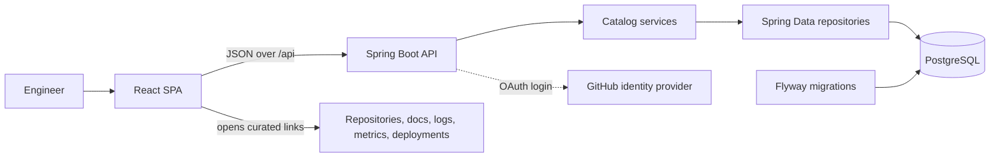
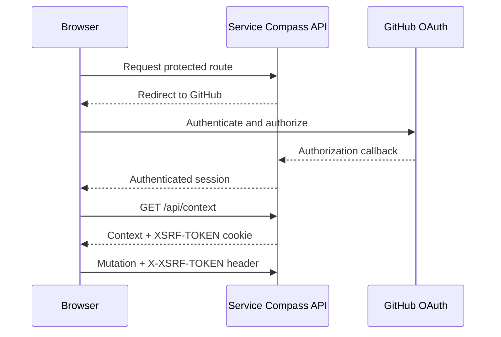

# Service Compass architecture

## System purpose

Service Compass is a curated engineering context catalog. Its primary entity is a **Service**, owned by one or more **Teams**, with links that may apply to an **Environment**. It points users to source repositories, runtime systems, documentation, observability tools, deployment dashboards, runbooks, and other resources. It does not deploy services or proxy those tools.

## High-level components

Nginx serves the production frontend image and proxies `/api` to the backend. During development, Vite provides the same proxy boundary.

## Frontend responsibilities

The TypeScript frontend:

- renders the catalog, Team groups, Service details, and Service forms
- searches already-loaded Services and Teams
- creates and deletes Teams and creates, edits, clones, and deletes Services
- imports and exports reusable catalog JSON
- opens external destination and repository links
- uses TanStack Query for server state and cache invalidation
- uses Zustand only for the list/grid display preference
- centralizes HTTP calls and CSRF header handling in `frontend/src/lib.ts`

It does not directly access PostgreSQL or external provider APIs.

## Backend responsibilities

Spring MVC controllers define the `/api` transport boundary and validate request DTOs. Application services implement catalog use cases and transaction boundaries:

- `ServiceCatalogService`: Service CRUD, search, Team assignment, Environment reuse/creation, and destination updates
- `TeamService`: Team creation/import, listing, and safe deletion
- `CatalogImportService`: reusable JSON import and export

The JPA entities currently serve as both persistence and core data models. Mapper code converts those entities to API responses.

## Domain concepts

- **Service:** named catalog entry with purpose, lifecycle, repository, tags, direct owners, Teams, and destinations.
- **Team:** Service owner grouping with a name, description, and owner/member contacts.
- **Environment:** reusable deployment context such as Production or Staging.
- **Destination:** named category of useful context, such as logs, metrics, documentation, Swagger, or deployment.
- **Destination link:** URL optionally scoped to an Environment, with access guidance and non-secret account identifiers.

Service names and Team names are unique case-insensitively. A Service must be assigned to at least one existing Team. Environments are created when a destination uses a new environment name.

## Persistence

PostgreSQL is the production source of truth. Spring Data JPA repositories own database access and Flyway owns schema evolution. H2-compatible migrations support the `local` profile and fast integration tests. New schema or corrective data changes must use new migrations; applied migrations are immutable.

## GitHub boundary and authentication

GitHub is currently an OAuth 2.0 identity provider only. There is no GitHub repository-import or metadata adapter.

Without the `oauth` Spring profile, all requests are permitted and CSRF is disabled for local development. With `oauth`, application requests require authentication and cookie-based CSRF protection is enabled. This mode is authentication, not role-based authorization.

## Important decisions

- The application stores curated links instead of duplicating external tools.
- External URLs are data, keeping provider-specific behavior out of catalog services.
- Destinations allow new labels without requiring a taxonomy subsystem.
- A destination can contain multiple links so the same resource type can vary by Environment.
- Catalog import/export uses the same validated request model as interactive editing.
- Docker images run the backend as a non-root user and serve the frontend through Nginx.

## Current limitations

- The structure is layered and feature-oriented, but not a strict hexagonal architecture. JPA entities are the effective domain model and repositories are called directly by application services.
- Authentication has no application roles or fine-grained authorization.
- The frontend fetches up to 100 Services and performs some catalog filtering client-side.
- Environments are created from destination input and do not have independent management use cases.
- Team updates are available through catalog import, not a dedicated interactive edit flow.
- Integrations are outbound links only. GitHub OAuth is the sole provider protocol integration.
- The codebase has integration tests but limited unit and frontend component coverage.

## Future integration boundaries

Future GitHub, Kubernetes, Grafana, or Argo CD integrations should be implemented behind provider-specific adapters. Catalog services should depend on small application-facing interfaces and provider DTOs should not leak into the core model. Background synchronization, credentials, retries, and provider rate limits should remain infrastructure concerns. These integrations are not currently implemented.
